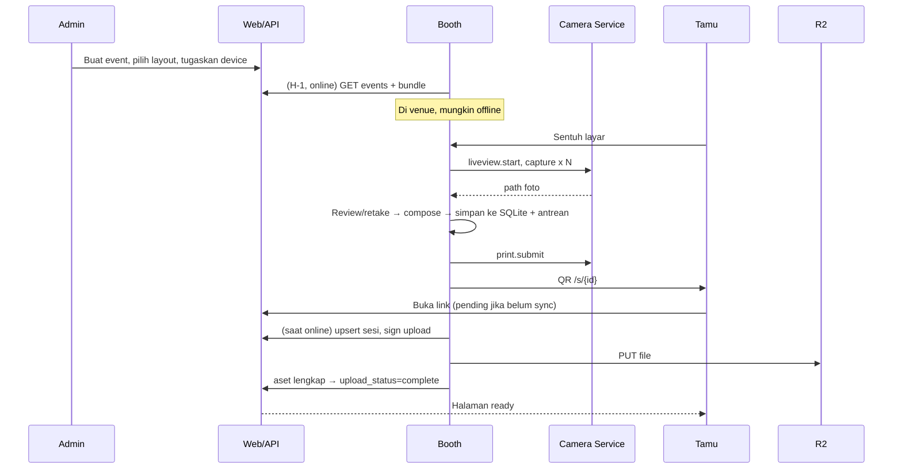
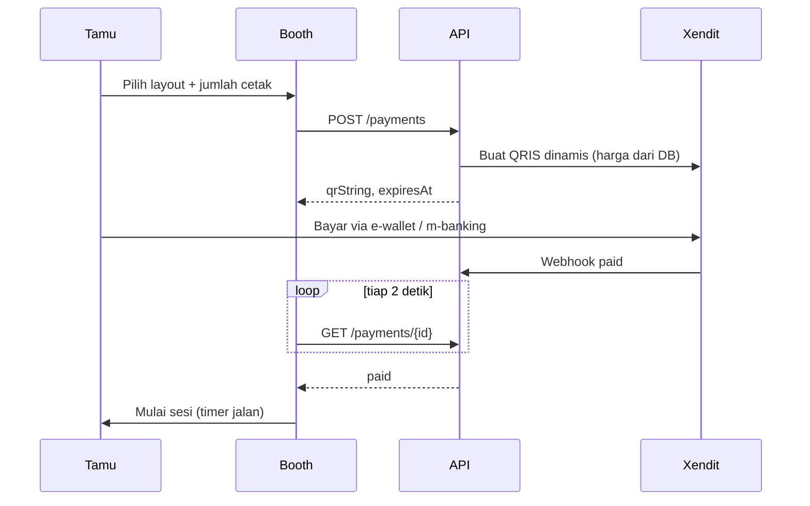

# 05 — Arsitektur

## 1. Diagram sistem

```mermaid
flowchart LR
  subgraph Venue["Venue (bisa offline)"]
    CAM[Canon / Sony]
    PRN[DNP RX1HS]
    subgraph Laptop["Laptop booth (Windows)"]
      SVC[Tetra Camera Service<br/>C# .NET]
      MAIN[Electron main<br/>SQLite · sync · supervisor]
      UI[Electron renderer<br/>React · template engine]
    end
    TV[TV / proyektor<br/>Live slideshow]
  end

  subgraph Cloud
    WEB[Next.js di Vercel<br/>API · tamu · klien · live · admin]
    DB[(Supabase<br/>Postgres · Auth · Realtime)]
    R2[(Cloudflare R2<br/>+ CDN media)]
    ZIP[Cloudflare Worker<br/>ZIP stream]
    XND[Xendit QRIS]
  end

  PHONE[HP tamu]
  CLIENT[Klien]
  ADMIN[Admin / crew]

  CAM -- USB --> SVC
  SVC -- USB --> PRN
  SVC <-- WebSocket localhost --> MAIN
  SVC <-- WebSocket localhost --> UI
  UI <-- IPC --> MAIN
  MAIN -- API + heartbeat --> WEB
  MAIN -- PUT presigned --> R2
  WEB --> DB
  WEB --> R2
  WEB <--> XND
  PHONE -- scan QR --> WEB
  PHONE -- gambar --> R2
  CLIENT --> WEB
  CLIENT -- download semua --> ZIP
  ZIP --> R2
  ADMIN --> WEB
  TV -- realtime --> WEB
```



## 2. Struktur repo

```
tetra-booth/
├─ CLAUDE.md
├─ docs/                       # dokumen ini
├─ apps/
│  ├─ booth/                   # Electron (electron-vite) — Windows, lalu macOS
│  │  ├─ src/main/             # SQLite, sync, supervisor, heartbeat, updater
│  │  ├─ src/preload/          # contextBridge API bertipe
│  │  └─ src/renderer/         # React: screens/, machines/, components/
│  ├─ booth-mobile/            # Capacitor — Android & iPad (Fase 7)
│  └─ web/                     # Next.js
│     ├─ app/s/[sessionId]/    # halaman tamu
│     ├─ app/g/[token]/        # galeri klien
│     ├─ app/live/[token]/     # live slideshow
│     ├─ app/admin/            # admin
│     └─ app/api/              # booth, publik, webhook, cron
├─ services/
│  └─ camera/                  # C# .NET: TetraCamera.sln
│     ├─ TetraCamera.Host/     # WebSocket server, dispatcher
│     ├─ TetraCamera.Canon/    # EDSDK
│     ├─ TetraCamera.Sony/     # CRSDK (Fase 5)
│     ├─ TetraCamera.HotFolder/
│     ├─ TetraCamera.Print/            # IPrinterAdapter
│     ├─ TetraCamera.Print.Windows/
│     ├─ TetraCamera.Print.Cups/       # Fase 6
│     └─ TetraCamera.Tests/
├─ workers/
│  └─ zip/                     # Cloudflare Worker
├─ packages/
│  ├─ booth-core/              # UI booth + state machine, tanpa Electron/Node (dipakai booth & booth-mobile)
│  ├─ platform-electron/       # adapter BoothPlatform untuk Electron
│  ├─ template-engine/         # render strip (dipakai booth & admin)
│  ├─ shared/                  # tipe, skema zod, konstanta, protokol camera service
│  ├─ ui/                      # design tokens v2 (08-DESIGN.md) + komponen bersama
│  └─ db/                      # tipe hasil generate Supabase + helper
└─ supabase/                   # config Supabase CLI + migrations/ + seed.sql
```

## 3. Alur hari event (mode event)



## 4. Alur photobox



## 5. Prinsip arsitektur

1. **Offline-first.** Tidak ada langkah sesi yang menunggu jaringan, kecuali pembayaran QRIS.
2. **Satu sumber render.** Template engine hanya di `packages/template-engine`.
3. **Tenant di mana-mana.** Setiap baris data punya `organization_id`; RLS menegakkannya.
4. **Server menentukan harga & izin.** Booth tidak dipercaya untuk nominal atau akses.
5. **Idempotent.** Semua operasi sync aman diulang.
6. **Native hanya untuk yang wajib native.** Kamera & print di C#; semua UI di React.
7. **UI booth tidak tahu platform.** `booth-core` hanya bicara ke `BoothPlatform`.
8. **Windows matang dulu.** Platform lain tidak dikerjakan sebelum kriteria matang Windows (Roadmap) tercapai.

## 6. Deployment

| Komponen | Target |
|---|---|
| `apps/web` | Vercel (production + preview per PR) |
| Database | Supabase (project dev & prod terpisah) |
| `workers/zip` | Cloudflare Workers |
| Media | Cloudflare R2 bucket `tetra-media-{env}` + custom domain |
| `apps/booth` + `services/camera` | Satu installer NSIS; artefak update di R2 |
