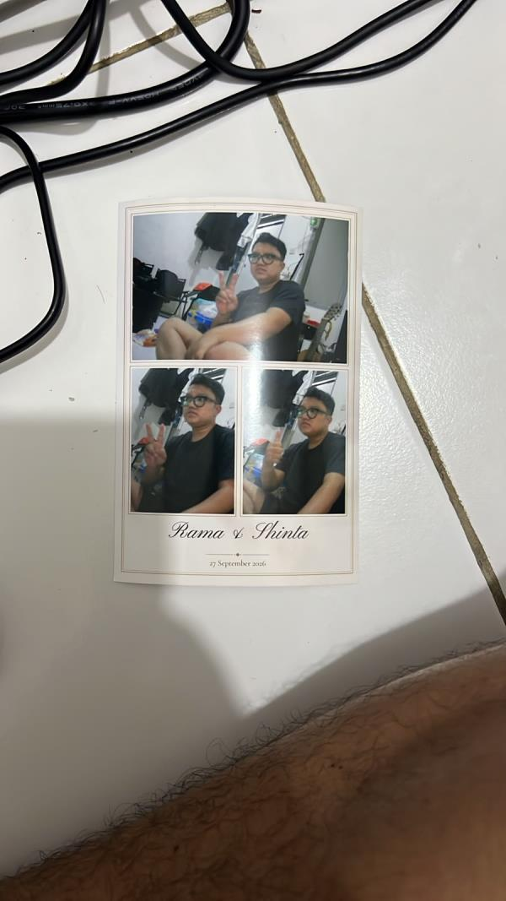

# W-031 — event 4R nyata (sementara: sesi 1 dari 2) — 2026-09-25

Laptop booth Rama, **Canon 60D** (700D sempat dipakai, lalu diganti Rama), digiCamControl 2.1.7, DNP DS-RX1 (antrean `DS-RX1 (Copy 1)`, 2inch cut **Disable**), booth dari source `win@2b90c80` dengan `--digicam` (bukan installer 0.5.x: `--digicam` belum ada di `main`). Data `C:/TetraBooth/w026/data` (B02). Event **"Rama & Shinta"** (`3f550b08…`, template Percontohan 4R v3), dipilih lewat mode crew → Sync dari Cloud.

Perintah: `electron apps/booth --digicam --data=C:/TetraBooth/w026/data --printer "DS-RX1 (Copy 1)" --paper-4r "(6x4)" --paper-2x6x2 "(6x4)" --print-offset 7.335,6.70`

## Hasil

| Kriteria | Sesi 1 (`Pb9kJALELB`) | Sesi 2 |
| --- | --- | --- |
| (a) 3 foto di slot benar (1 besar landscape + 2 portrait), tidak gepeng | ✔ | menunggu |
| (b) cetakan DNP utuh, bingkai emas di 4 sisi, font skrip + serif | ✔ (foto di bawah) | menunggu |
| (c) QR → halaman tamu di HP: Strip + 3 Original + Animasi GIF | ✔ (iPhone; ikon Wi-Fi terlihat, belum pasti data seluler) | menunggu |
| (d) sesi ada di galeri klien `/g/oiDh…` dan live `/live/kPAr…` | ✔ (HTML berisi `Pb9kJALELB`) | menunggu |

Log sesi 1: printing → qr 0,02 s, `[print] selesai` 0,6 s setelah kirim, `[session] selesai … 10 aset, 1059 ms`. Kertas 620/700. **Jatah: 1 dari 3 lembar terpakai.**

## Sebelum sesi nyata

- Uji kering ke Print to PDF (0 lembar): 60D 3/3 foto, review 22 s, desain 4R benar. Foto pertama hampir hitam (ISO 6400, 1/100, f/5 di kamar gelap). Setelah lampu dinyalakan, foto uji terang.
- 700D dua kali macet: "EOS capture end" tanpa file terkirim, lalu kamera hilang dari USB. Dugaan: live view dibaca selama jepret. Perbaikan `2b90c80`: live view dimatikan sebelum `capture` dan menyala lagi di countdown berikutnya. Setelah itu 60D lancar. 700D belum diuji ulang dengan perbaikan ini.
- `2b90c80`: `All_Minimize` setelah `LiveViewWnd_Show`, jadi jendela live view digiCamControl tidak lagi menutupi booth (dicek dengan screenshot desktop).
- Masih ada: splash "Loading…" digiCamControl (topmost) menutupi booth saat cold start. Hanya bisa dimatikan dengan `Branding.xml` (ShowStartupScreen=false) di folder instalasi (butuh admin). Instruksi salin manual sudah diberikan ke Rama.

## Masukan Rama

- Setelan kamera di mode crew perlu **pilihan autofocus / manual focus**, selain ISO/shutter/aperture/WB. Sesi 1 agak buram. digiCamControl punya perintah fokus di jendela live view (tombol Auto Focus) yang bisa dipetakan ke API web. Belum diverifikasi.
