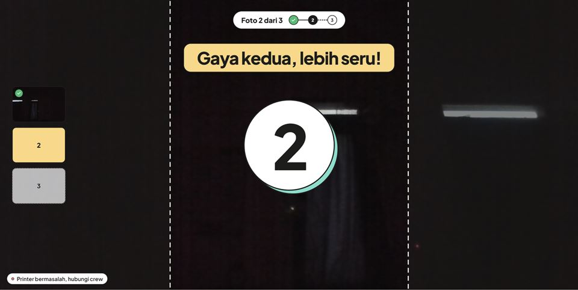
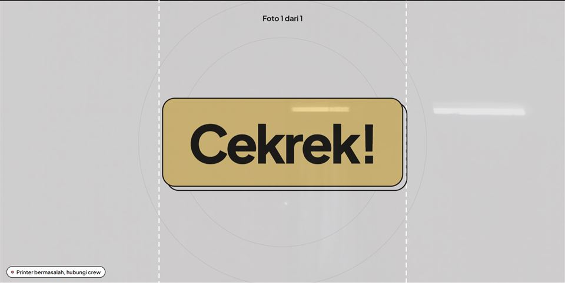

# Full auto 26 Sep malam: 0.5.18 terpasang (tanpa DNP & 60D)

DNP dan 60D dibawa crew untuk event. Uji memakai webcam laptop, booth terpasang B02, dan booth dev `win`.

## 1. Update
- 0.5.16 → 0.5.17: unduh latar belakang 21 s (±7,5 MB/s), Pasang Sekarang memakai file itu, `berhasil`.
- 0.5.17 → 0.5.18: 158 MB ±20 s, `berhasil: 0.5.17 → 0.5.18`. Log masih `mengunduh 0.5.18 (158 MB)` tanpa
  "4 bagian", karena yang mengunduh adalah pengunduh 0.5.17. Unduh paralel baru teruji di update 0.5.18 → berikutnya.

## 2. Override pengaturan event (#100), build terpasang 0.5.17 dan 0.5.18
Event "Rama & Shinta": hitung mundur 3→4, maks. cetak 2→3 → badge → **Sync dari Cloud tetap 4/3** →
Kembalikan ke cloud → 3/2, badge hilang. Lulus di kedua versi.

## 3. Panduan bingkai live view (#107), webcam 1280×720, booth dev
- "Rama & Shinta" foto 2, slot `498×680` (portrait): garis panduan selebar ±780 px di jendela 1899×953. Hitungan:
  720 × 498/680 = 527 px frame × skala cover 1,484 = 782. Cocok. 
- "Uji Portrait" (salinan lokal layout photobox 4R Single, slot `1120×1440`): ±830 px, hitungan 831. Cocok.
  
- Catatan UX: layar review menampilkan foto webcam utuh 16:9, bukan potongan slot, sehingga tamu melihat area yang
  nanti terpotong di cetakan. Mungkin sengaja (#35: review = foto asli), tapi tidak cocok dengan panduan bingkai.

## 4. Photobox + template editor (#108)
Butuh login admin untuk mencentang template editor dan "Simulasikan bayar". Laptop tanpa rahasia (aturan
handover), jadi **menunggu Rama**.

## 5. Suara
Menyalakan Suara di event cloud butuh admin (menunggu Rama). Urutan cue sudah diuji dengan bundle lokal
`countdownSound: true` (lihat issue #1): jepret terpotong sorakan → diperbaiki `playAfter` (`eca75e9`).
