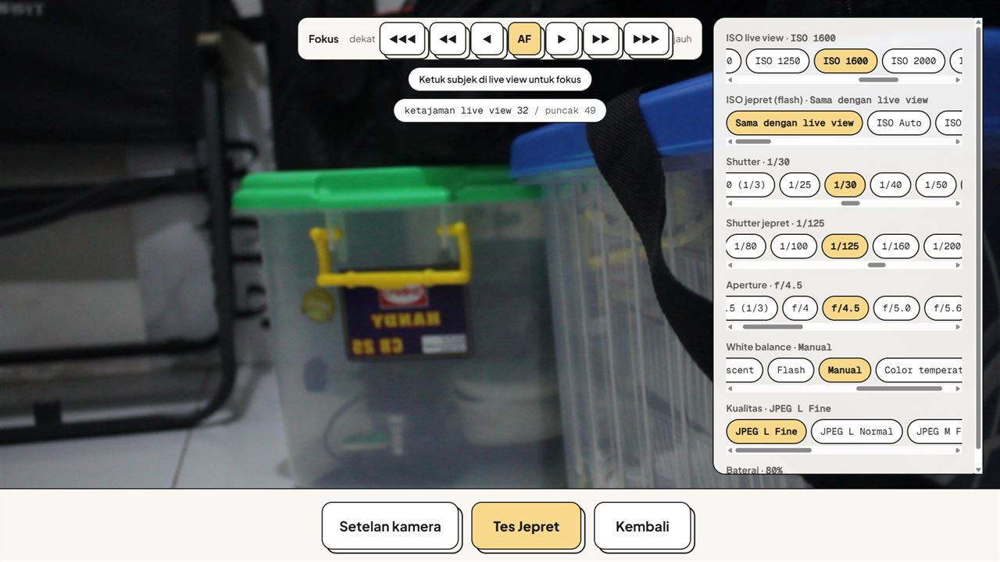

# W-035 Tes Jepret + Setelan kamera (60D, 0.5.31 terpasang), 30 Sep

Setelan: ISO live 1600, Shutter 1/30, Shutter jepret 1/125, ISO jepret "Sama dengan live view" (tanpa flash di lokasi),
JPEG L Fine. Tanpa DNP.

1. **Panel** di x 912–1259 dari lebar jendela 1280 (tengah 640): tidak menutupi area tengah live view. Live view terang
   (kecerahan 67 di ruang redup; 1/125 memberi ±28–52).
2. **5× Tes Jepret:** klik → preview **1,68–1,98 s**. EXIF semua **ISO 1600, 1/125 s**, 5184×3456, 3,8 MB. Setelah tiap
   jepret setelan kamera kembali ke **ISO 1600 / 1/30** (nilai live view).
3. **Kualitas:** M Fine 3456×2304 2,0 MB 1,66 s · S1 Fine 2592×1728 1,2 MB 1,45 s · L Fine 5184×3456 4,0 MB 1,62 s.
4. **Klik di panel** tidak memicu fokus (log `fokus ketuk` +0). Klik di live view → +1 (AF di titik itu).

Catatan: skor ketajaman 8–20 karena fokus belum diarahkan ke benda (bukan masalah jepret). Flash belum diuji (tidak
tersedia): uji ISO jepret rendah + flash saat perangkat flash ada.
